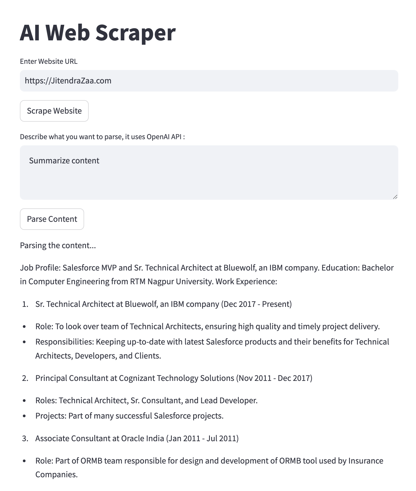

# AI-Web-Scraper
- An AI web scraper using Langchain, OpenAI, Selenium and other libraries.
Run application using commans `streamlit run main.py`

# Sample Outcome



# Important Link / References
- Python Selenium Documentat [Link](https://selenium-python.readthedocs.io/getting-started.html)
- Langchain OpenAI [Link](https://python.langchain.com/docs/integrations/llms/openai/) 

# Prerequisites 
1. Run below command to install all dependencies from requirements.txt file
```bash
pip install -r requirements.txt
```

2. Install "ChromeDriver" (do not download chrome) from [here](https://googlechromelabs.github.io/chrome-for-testing/#stable)  and put chromedriver in same folder. (Sample already)